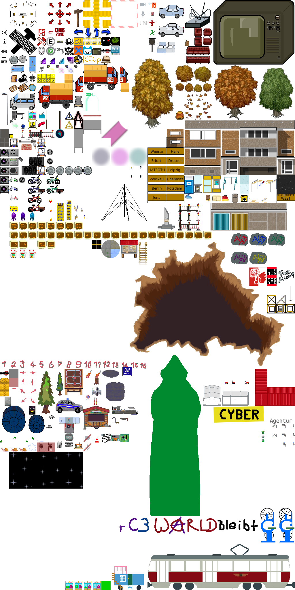

# chaoszone

Central ChaosZ0ne Hub map used by all spaces to jump between them.

We are trying to collect all tiles that can be used inside workadventure for Hackspaces.

Work in progress.

## chaos_zone_shared.png

## Mentions

Some leaves of the trees (not the trunks!) are inspired by [Mack and BenBen, and XP](https://grandmadebslittlebits.wordpress.com/2015/09/04/benbens-trees-with-complete-credits-for-rpg-maker-mv-or-rpg-maker-vxace/)
